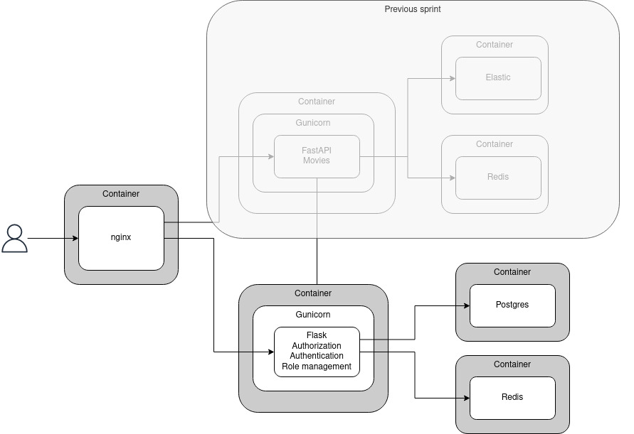

Repo address:
https://github.com/cement-hools/Auth_sprint_1/

# Flask-based Auth API
Sprint 6 in Practicum middle-python course.  
Teamwork of
* [Maxim Sekachev ](https://github.com/cement-hools)
* [Andrey Lepekhin](https://github.com/andrey-lepekhin)

Architecture
[](./schemas/architecture.jpeg) 

## Run
```
make prod
# That's all, see for yourself:
curl  -H "Content-Type: application/json" -d "{\"login\": \"testuser\", \"email\": \"email@example.com\", \"password\": \"testpassword\"}" http://localhost/api/v1/registration | json_pp -json_opt pretty,canonical
make stop
```

### Create users
While app is running you can create users like so:
```
make user args="superman super@example.com p@ssword --admin"
```

## Development
### Pre-commit hooks
* pip install pre-commit from requirements.txt
* `pre-commit install`
* Done!

You can run it manually via `pre-commit run --all-files` or wait for pre-commit hooks to do it automatically on commit.

### Run dev containers
```
make dev
```